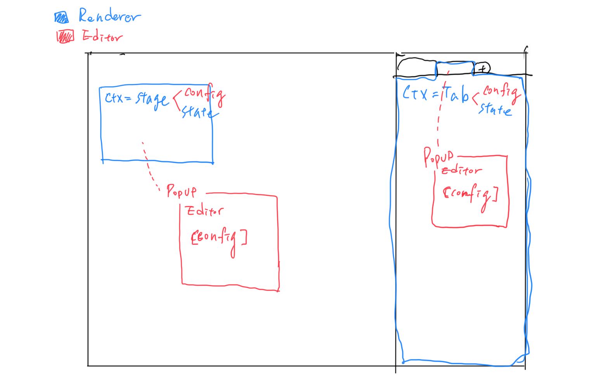

# Scene Module Generic Design

Scene can be seen as a slide rendering multiple interactive modules with a main canvas(Stage) and a right-rail. Configurations and appearance are edited in the Editor. State stands for the current interactive results when the scene is being hosted.

**Configurations**: e.x. source of media player

**Appearance**: e.x. the height, width, and position in the stage

**State**: e.x. current player status for co-watch



There are multiple modules including Image, Chatroom, Q&A, Polling, Media Player, Meeting and more will be developed in a scene. A scene is currently composed of sections, Stage and Right-rail (Tab). In the future, more sections will be in a scene.

A scene module can used in various different sections(contexts) includes Stage, Tab, Hidden...

**config**:

### **1. Register module manifest:**

```json
{
  "typeId": "5fe1e559-f86d-4607-899d-b7f52e6ac8fa",
  "name": "Awesome Polling",
  "displayName": "Poll",
  "description": "A polling plug-in",
  "capabilities": [
    {
      "context": "Stage",
      "appearance": {
        "defaultWidth": 400,
        "defaultHeight": 200,
        "resizable": true | false
      },
      "defaultState": { ... },
      "defaultConfig": { ... }
    },
    {
      "context": "Tab",
      "appearance": {
        "displayName": "Result",
        "canRename": true | false
      },
      "defaultState": { ... },
      "defaultConfig": { ... }
    },
    {
      "context": "Hidden",
      "defaultState": { ... },
      "defaultConfig": { ... }
    }
  ]
}

```

Explanation:

**appearance**: The GUI appearance in Asiania (the container of generic component)

**defaultConfig** (optional): Default value of module configuration (free JSON). It'll pass into this module's editing renderer so organizer can change this config value through editing interface.

**defaultState** (optional): Default value of runtime state (free JSON). It'll be used as default runtime state if nothing loaded from Fluid container.

Example Code:

```typescript
type ModuleContext = "Stage" | "Tab";

interface ModuleDescriptor {
  ModuleClass: new () => IModuleProvider<any, any>;
  typeId: string;
  name: string;
  displayName: string;
  description: string;
  capabilities: ModuleCapability[];
}

interface ModuleCapability {
  context: ModuleContext;
  defaultConfig?: any;
  defaultState?: any;
}

interface StageModuleCapability extends ModuleCapability {
  context: "Stage";
  appearance: {
    defaultWidth?: number;
    defaultHeight?: number;
    resizable?: boolean;
  };
}

interface TabModuleCapability extends ModuleCapability {
  context: "Tab";
  appearance: {
    displayName: string;
    canRename: boolean;
  };
}

const findModuleDescriptor = (typeId: string): ModuleDescriptor | undefined => {
  if (typeId === "5fe1e559-f86d-4607-899d-b7f52e6ac8fa") {
    return {
      ModuleClass: MyModule,
      typeId: "5fe1e559-f86d-4607-899d-b7f52e6ac8fa",
      name: "Awesome Polling",
      displayName: "Poll",
      description: "A polling plug-in",
      capabilities: [
        {
          context: "Stage",
          appearance: {
            defaultWidth: 400,
            defaultHeight: 200,
            resizable: true,
          },
          defaultState: {},
          defaultConfig: {},
        } as StageModuleCapability,
        {
          context: "Tab",
          appearance: {
            displayName: "Result",
            canRename: false,
          },
        } as TabModuleCapability,
      ],
    };
  }
};
```

### **2. Each module provides React renderers for editing and module itself respectively:**

- `getEditor(context: ModuleContext, config = defaultConfig || {}): JSX.Element`
- `getRenderer(context: ModuleContext, currentUserRole?: Role, state = defaultState || {}): JSX.Element`

Example Code:

```typescript
interface IModuleRenderer<T, U> {
  eventId: string;
  sceneId: string;
  currentUserRole: string;
  isEditMode: boolean;
  state?: T;
  config?: U;
}

interface IModuleEditor<U> {
  sceneId: string;
  config?: U;
}

interface IModuleProvider<T, U> {
  getRenderer(ctx: ModuleContext): React.FC<IModuleRenderer<T, U>>;
  getEditor(ctx: ModuleContext): React.FC<IModuleEditor<U>>;
}

/////////////////////////////////////////////////////////////////////
//
//  Custom Module Class
//
/////////////////////////////////////////////////////////////////////

interface IMyModuleState {
  complete?: boolean;
}

interface IMyModuleConfig {
  allowMultiChoice?: boolean;
}

class MyModule implements IModuleProvider<IMyModuleState, IMyModuleConfig> {
  getEditor(ctx: ModuleContext): React.FC<IModuleEditor<IMyModuleConfig>> {
    return (props) => {
      const { sceneId, config = {} } = props;
      const { allowMultiChoice } = config;
      if (ctx === "Stage") {
        return (
          <>
            {"Edit STAGE"}
            {`${sceneId} ${allowMultiChoice}`}
          </>
        );
      } else if (ctx === "Tab") {
        return (
          <>
            {"Edit TAB"}
            {`${sceneId} ${allowMultiChoice}`}
          </>
        );
      }
      return null;
    };
  }

  getRenderer(
    ctx: ModuleContext
  ): React.FC<IModuleRenderer<IMyModuleState, IMyModuleConfig>> {
    return (props) => {
      const {
        eventId,
        sceneId,
        currentUserRole,
        isEditMode,
        state = {},
        config = {},
      } = props;

      const { complete } = state;
      const { allowMultiChoice } = config;

      if (ctx === "Stage") {
        return (
          <>
            {"STAGE"}
            {`STATE: ${eventId} ${sceneId} ${currentUserRole} ${isEditMode} ${complete}`}
            {`CONFIG: ${allowMultiChoice}`}
          </>
        );
      } else if (ctx === "Tab") {
        return (
          <>
            {"TAB"}
            {`STATE: ${eventId} ${sceneId} ${currentUserRole} ${isEditMode} ${complete}`}
            {`CONFIG: ${allowMultiChoice}`}
          </>
        );
      }
      return null;
    };
  }
}
```

Put everything together:

```typescript
/////////////////////////////////////////////////////////////////////
//
//  Asiania client code for scene editor
//
/////////////////////////////////////////////////////////////////////

type ModuleInstance = {
  typeId: string;
  objId: string;
};

export const StageModuleEditor: React.FC<ModuleInstance> = ({
  typeId = "5fe1e559-f86d-4607-899d-b7f52e6ac8fa",
  objId,
}) => {
  const { ModuleClass, capabilities } = findModuleDescriptor(typeId)!;
  const moduleProvider = React.useMemo(() => new ModuleClass(), [ModuleClass]);

  const { defaultConfig } = capabilities.find(
    (x) => x.context === "Stage"
  ) as StageModuleCapability;

  const config = apiQueryModuleConfig(objId) || defaultConfig;
  const Editor = moduleProvider.getEditor("Stage");

  return <Editor sceneId="sceneId" config={config} />;
};

export const StageModuleRenderer: React.FC<ModuleInstance> = ({
  typeId = "5fe1e559-f86d-4607-899d-b7f52e6ac8fa",
  objId,
}) => {
  const { ModuleClass, capabilities } = findModuleDescriptor(typeId)!;
  const moduleProvider = React.useMemo(() => new ModuleClass(), [ModuleClass]);

  const {
    defaultState,
    defaultConfig,
    appearance: { defaultHeight, defaultWidth, resizable },
  } = capabilities.find((x) => x.context === "Stage") as StageModuleCapability;

  const config = apiQueryModuleConfig(objId) || defaultConfig;
  const state = apiQueryModuleState(objId) || defaultState;
  const Comp = moduleProvider.getRenderer("Stage");

  return (
    <div style={{ width: defaultWidth, height: defaultHeight }}>
      <Comp
        eventId="eventId"
        sceneId="sceneId"
        currentUserRole="user"
        isEditMode={true}
        state={state}
        config={config}
      />
    </div>
  );
};
```

Explanation:

To remain the flexibility of module's configuration. The config is requested to the backend. As a interactive runtime results, state is requested for sure.

> The generic design focuses on the flexibility and decoupling of scene modules for a better developing experience. Developers just need to create the editor and renderer of a single module in the future. The developing process will be fastened. Scene modules are treated as dynamic components.
